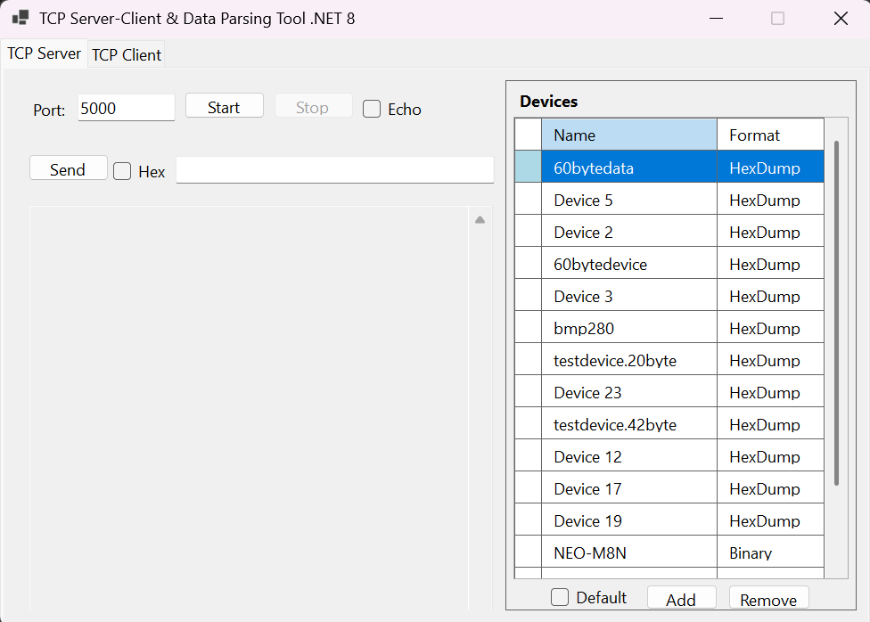
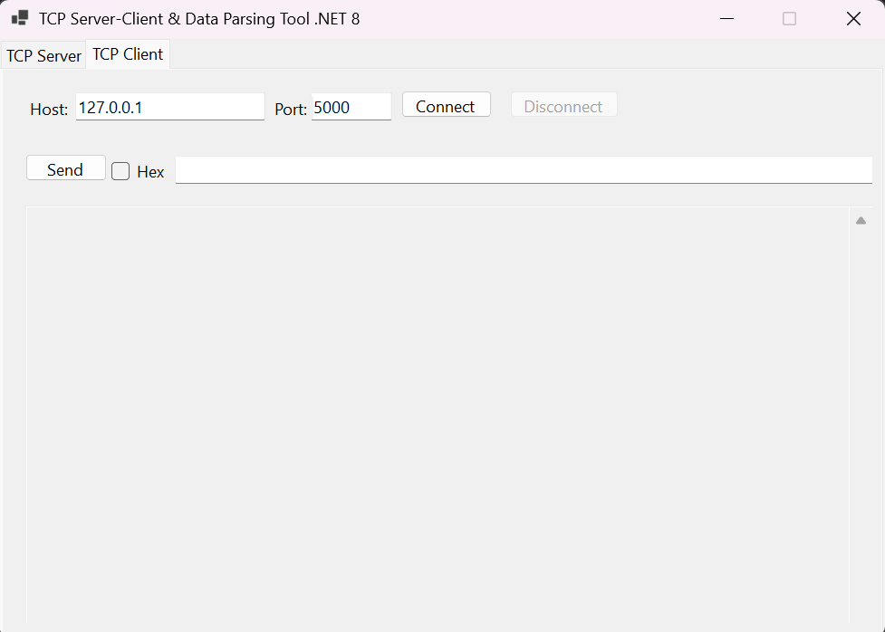
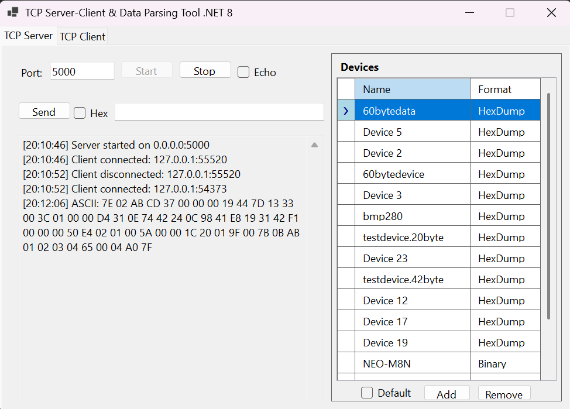
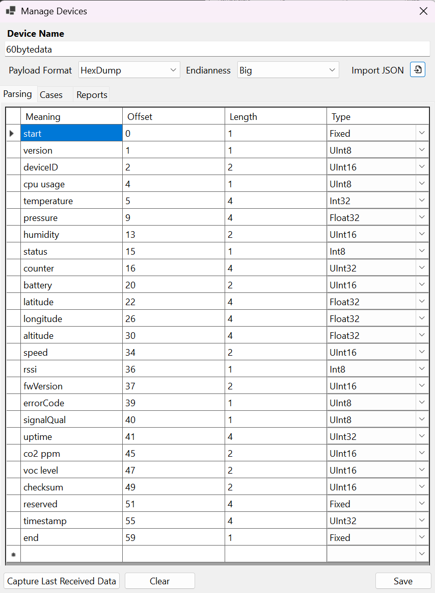
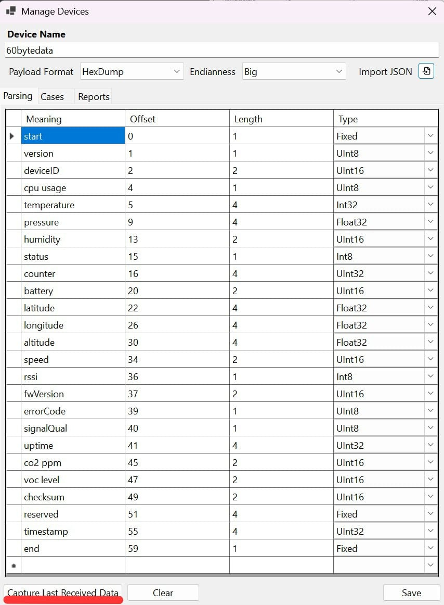
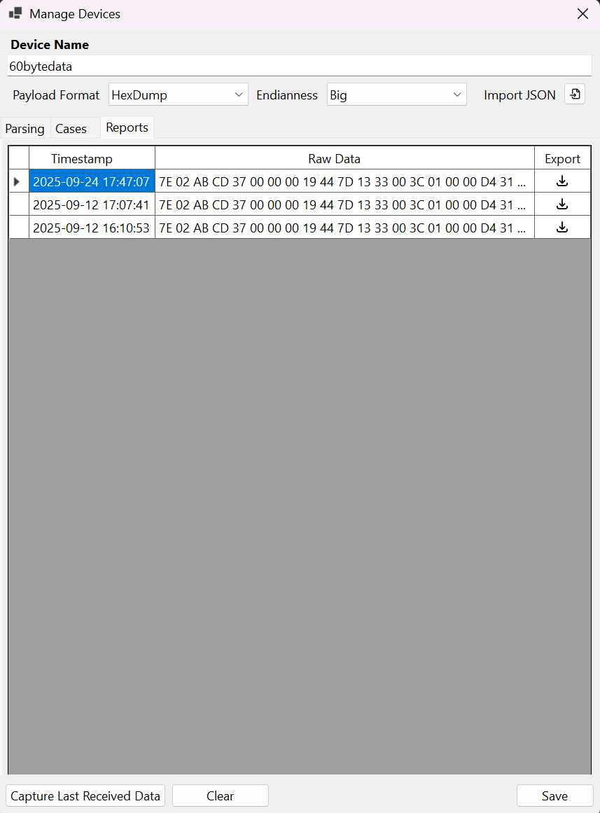
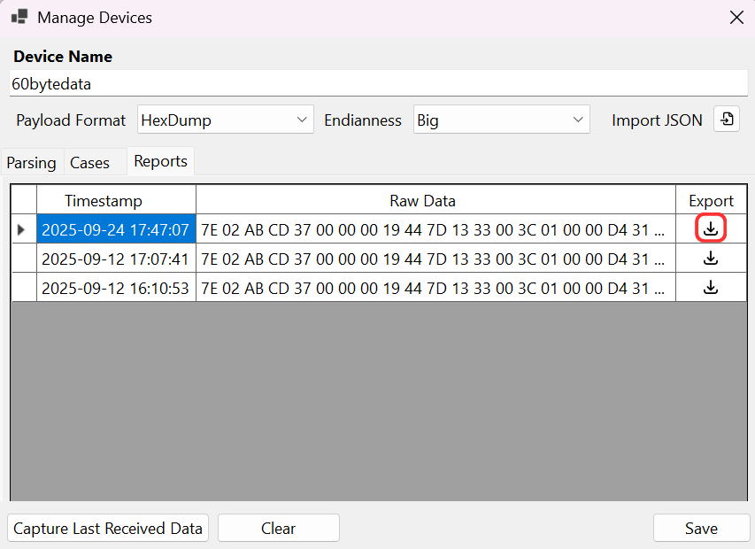

# TCP Server-Client & Data Parsing Tool

The motivation behind this project is the fact that TCP is only a transport protocol that guarantees reliable communication, but does not define any message format at the application level. Applications that communicate over TCP must decide for themselves how the data will be structured and interpreted.
In contrast, protocols such as SNMP not only provide the communication channel but also standardize the message format. With SNMP's PDU structures and MIB tables, both the way messages are packaged and the meaning of each field are predefined, allowing devices to communicate in a common language.
This application is designed with that distinction in mind. While it functions like a simple TCP server-client tool, what sets it apart is its data parsing capability. In other words, it doesn't just transfer raw data end-to-end; it also parses and interprets the incoming data based on predefined rules. This adds a layer of structure and standardization at the application level, complementing TCP's "deliver but don't interpret" approach.
Thus, the project combines the transport reliability of TCP with an SNMP-like approach to meaningful and standardized message formatting. This enables different applications to exchange data consistently and in a way that is easy to process.

________________________________________

## Tutorial & Key Features

1. **Basic TCP Server-Client Functions**
   - The application covers all essential TCP server-client requirements (port, start, stop, echo, connect, disconnect, server, client, send, etc.).

   
   
   
2. **Receiving Data**
   - As a starting point, we open a port and connect to the server. Suppose the device sends the following 60-byte payload:
     `7E 02 AB CD 37 00 00 00 19 44 7D 13 33 00 3C 01 00 00 D4 31 0E 74 42 24 0C 98 41 E8 19 31 42 F1 00 00 00 50 E4 02 01 00 5A 00 00 1C 20 01 9F 00 7B 0B AB 01 02 03 04 65 00 04 A0 7F`

   
   
3. **Device Configuration**
   - In the Devices section of the server, you can select the device and enter its name.
     - In the Cases section, you may configure payload parsing manually (by specifying format, endianness, meaning, offset, length, and type),
     - or use the Import JSON button to load a JSON file containing the device's datasheet parameters. (A pop-up will open, allowing you to choose a JSON file from any location on your computer.)
   - This is especially useful for devices with many parameters. Once the configuration is complete, click Save.

   
   

4. **Data Parsing**
   - After configuring the device, you can move to the data parsing step.
     - Select the device that corresponds to the incoming data.
     - Click Capture Last Received Data.
     - The tool will capture the latest raw data (in hex or binary), parse it according to the configured parameters, and transfer the results to the Reports section under Manage Devices.

   
   

5. **Reports & Export**
   - In the Reports section, the most recent data appears at the top, along with its timestamp and raw data.
   - An Export column allows you to download the parsed data. Clicking the download icon opens a pop-up to save the interpreted data as a JSON file on your computer.

   

________________________________________

## Notes
- The Clear button in Manage Devices resets all parameters of the selected device.
- When sending data:
  - If Hex is unchecked, the entered text is sent as plain ASCII.
  - If Hex is checked, the input is interpreted as a hex string and then sent.
- When the Default checkbox is selected in the Devices group box, the application works as a simple TCP server-client, and the Devices section is disabled.

---

## Prerequisites

- Windows 10 or Windows 11 (Windows Forms requires Windows)
- .NET SDK 8.0 or later (supports net8.0-windows)
- Visual Studio 2022/2023 with the "NET desktop development" workload OR dotnet CLI
- Optional: administrator privileges if you need to listen on low-numbered ports

## Quick start

Using Visual Studio
1. Open `TcpTool/TcpTool.csproj` in Visual Studio.
2. Restore packages if prompted, build the project and run (F5).

Using dotnet CLI
1. From the repository root:
   - dotnet restore
   - dotnet build ./TcpTool/TcpTool.csproj -c Debug
   - dotnet run --project ./TcpTool/TcpTool.csproj -c Debug

Note: When running from Visual Studio the application working directory is typically `TcpTool/bin/Debug/net8.0-windows`.

## Sample data

- Device parameters can be imported using the Import JSON button in the Manage Devices window. You can select any JSON file from any location on your computer.
- The expected format for Import JSON is as follows:

```json
{
  "payload_format": "HexDump",
  "endianness": "big",
  "packet_structure": [
    { "meaning": "start", "offset": 0, "length": 1, "type": "Fixed" },
    { "meaning": "version", "offset": 1, "length": 1, "type": "UInt8" },
    { "meaning": "deviceID", "offset": 2, "length": 2, "type": "UInt16" },
    { "meaning": "cpu usage", "offset": 4, "length": 1, "type": "UInt8" },
    { "meaning": "temperature", "offset": 5, "length": 4, "type": "Int32" },
    { "meaning": "pressure", "offset": 9, "length": 4, "type": "Float32" },
    { "meaning": "humidity", "offset": 13, "length": 2, "type": "UInt16" },
    { "meaning": "status", "offset": 15, "length": 1, "type": "Int8" },
    { "meaning": "counter", "offset": 16, "length": 4, "type": "UInt32" },
    { "meaning": "battery", "offset": 20, "length": 2, "type": "UInt16" },
    { "meaning": "latitude", "offset": 22, "length": 4, "type": "Float32" },
    { "meaning": "longitude", "offset": 26, "length": 4, "type": "Float32" },
    { "meaning": "altitude", "offset": 30, "length": 4, "type": "Float32" },
    { "meaning": "speed", "offset": 34, "length": 2, "type": "UInt16" },
    { "meaning": "rssi", "offset": 36, "length": 1, "type": "Int8" },
    { "meaning": "fwVersion", "offset": 37, "length": 2, "type": "UInt16" },
    { "meaning": "errorCode", "offset": 39, "length": 1, "type": "UInt8" },
    { "meaning": "signalQual", "offset": 40, "length": 1, "type": "UInt8" },
    { "meaning": "uptime", "offset": 41, "length": 4, "type": "UInt32" },
    { "meaning": "co2 ppm", "offset": 45, "length": 2, "type": "UInt16" },
    { "meaning": "voc level", "offset": 47, "length": 2, "type": "UInt16" },
    { "meaning": "checksum", "offset": 49, "length": 2, "type": "UInt16" },
    { "meaning": "reserved", "offset": 51, "length": 4, "type": "Bytes" },
    { "meaning": "timestamp", "offset": 55, "length": 4, "type": "UInt32" },
    { "meaning": "end", "offset": 59, "length": 1, "type": "Fixed" }
  ]
}
```

- This is a sample device configuration for import. You can adjust the fields and types as needed for your device.

## Export Data Example

Below is an example of exported device data:

```json
[
  {
    "DeviceName": "60bytedata",
    "Timestamp": "2025-09-24T17:47:07.9470037+03:00",
    "RawDataHex": "7E 02 AB CD 37 00 00 00 19 44 7D 13 33 00 3C 01 00 00 D4 31 0E 74 42 24 0C 98 41 E8 19 31 42 F1 00 00 00 50 E4 02 01 00 5A 00 00 1C 20 01 9F 00 7B 0B AB 01 02 03 04 65 00 04 A0 7F",
    "ParsedFields": [
      { "Meaning": "start", "ParsedValue": "7E", "DisplayValue": "7E", "Offset": 0, "Length": 1, "Type": 8 },
      { "Meaning": "version", "ParsedValue": 2, "DisplayValue": "2", "Offset": 1, "Length": 1, "Type": 0 },
      { "Meaning": "deviceID", "ParsedValue": 43981, "DisplayValue": "43981", "Offset": 2, "Length": 2, "Type": 2 },
      { "Meaning": "cpu usage", "ParsedValue": 55, "DisplayValue": "55", "Offset": 4, "Length": 1, "Type": 0 },
      { "Meaning": "temperature", "ParsedValue": 25, "DisplayValue": "25", "Offset": 5, "Length": 4, "Type": 5 },
      { "Meaning": "pressure", "ParsedValue": 1012.3, "DisplayValue": "1012.299988", "Offset": 9, "Length": 4, "Type": 6 },
      { "Meaning": "humidity", "ParsedValue": 60, "DisplayValue": "60", "Offset": 13, "Length": 2, "Type": 2 },
      { "Meaning": "status", "ParsedValue": 1, "DisplayValue": "1", "Offset": 15, "Length": 1, "Type": 1 },
      { "Meaning": "counter", "ParsedValue": 54321, "DisplayValue": "54321", "Offset": 16, "Length": 4, "Type": 4 },
      { "Meaning": "battery", "ParsedValue": 3700, "DisplayValue": "3700", "Offset": 20, "Length": 2, "Type": 2 },
      { "Meaning": "latitude", "ParsedValue": 41.0123, "DisplayValue": "41.012299", "Offset": 22, "Length": 4, "Type": 6 },
      { "Meaning": "longitude", "ParsedValue": 29.0123, "DisplayValue": "29.012300", "Offset": 26, "Length": 4, "Type": 6 },
      { "Meaning": "altitude", "ParsedValue": 120.5, "DisplayValue": "120.500000", "Offset": 30, "Length": 4, "Type": 6 },
      { "Meaning": "speed", "ParsedValue": 80, "DisplayValue": "80", "Offset": 34, "Length": 2, "Type": 2 },
      { "Meaning": "rssi", "ParsedValue": -28, "DisplayValue": "-28", "Offset": 36, "Length": 1, "Type": 1 },
      { "Meaning": "fwVersion", "ParsedValue": 513, "DisplayValue": "513", "Offset": 37, "Length": 2, "Type": 2 },
      { "Meaning": "errorCode", "ParsedValue": 0, "DisplayValue": "0", "Offset": 39, "Length": 1, "Type": 0 },
      { "Meaning": "signalQual", "ParsedValue": 90, "DisplayValue": "90", "Offset": 40, "Length": 1, "Type": 0 },
      { "Meaning": "uptime", "ParsedValue": 7200, "DisplayValue": "7200", "Offset": 41, "Length": 4, "Type": 4 },
      { "Meaning": "co2 ppm", "ParsedValue": 415, "DisplayValue": "415", "Offset": 45, "Length": 2, "Type": 2 },
      { "Meaning": "voc level", "ParsedValue": 123, "DisplayValue": "123", "Offset": 47, "Length": 2, "Type": 2 },
      { "Meaning": "checksum", "ParsedValue": 2987, "DisplayValue": "2987", "Offset": 49, "Length": 2, "Type": 2 },
      { "Meaning": "reserved", "ParsedValue": "01 02 03 04", "DisplayValue": "01 02 03 04", "Offset": 51, "Length": 4, "Type": 8 },
      { "Meaning": "timestamp", "ParsedValue": 1694500000, "DisplayValue": "1694500000", "Offset": 55, "Length": 4, "Type": 4 },
      { "Meaning": "end", "ParsedValue": "7F", "DisplayValue": "7F", "Offset": 59, "Length": 1, "Type": 8 }
    ]
  }
]
```

## Usage example

1. Start the server: open the app, set the port and click Start Server.
2. Send data from a client or device to that port.
3. Open Manage Devices to create or import a device definition (use Import JSON to load datasheet fields), then Save.
4. In Manage Devices > Parsing, select the device and click "Capture Last Received Data" to parse the most recent payload.
5. Switch to Reports to review parsed results. Use the Export button to save parsed reports as JSON

